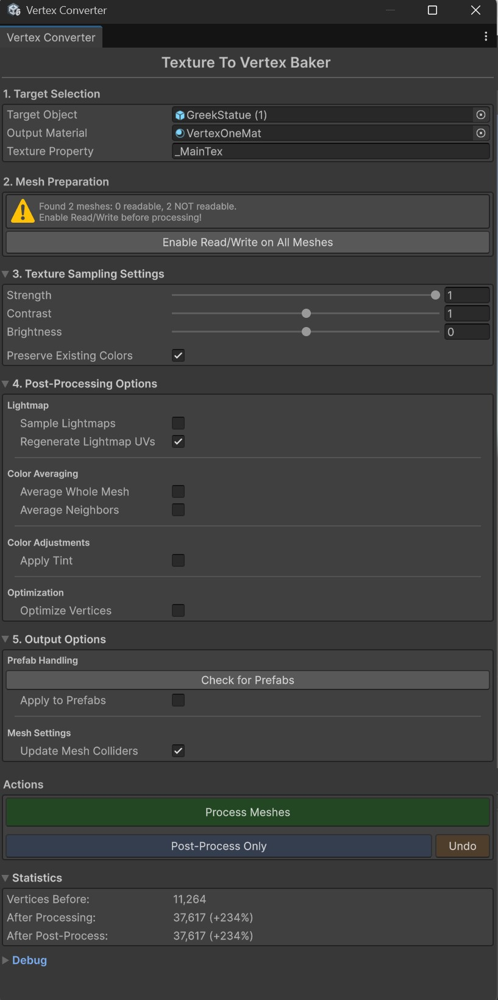
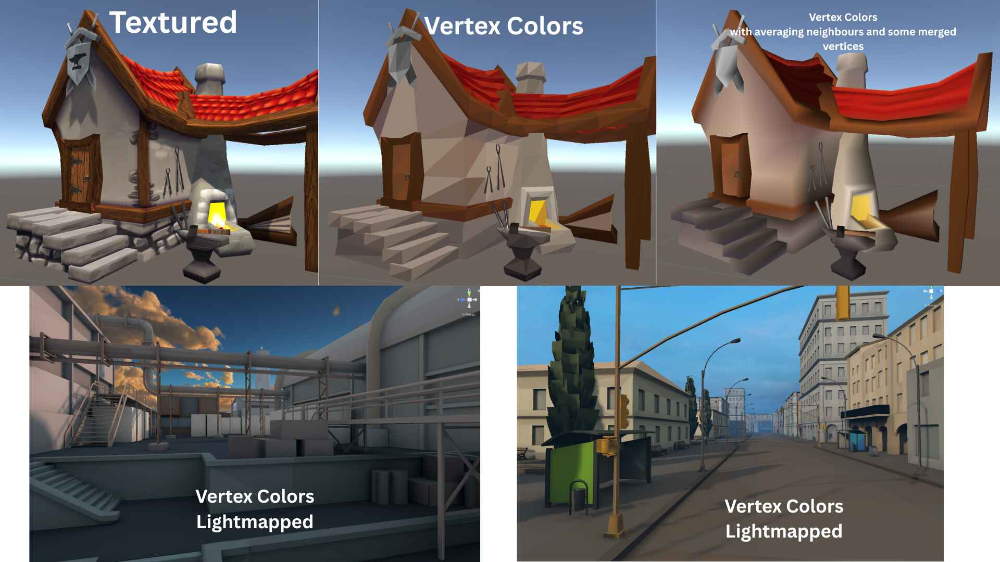

# Texture to Vertex Baker

  
  &nbsp;&nbsp;
  

  <em>Tool UI</em> &nbsp;&nbsp;&nbsp;&nbsp;&nbsp;&nbsp;&nbsp;&nbsp;&nbsp;&nbsp;&nbsp;&nbsp;&nbsp;&nbsp;&nbsp;&nbsp;&nbsp;&nbsp;&nbsp;&nbsp;&nbsp;&nbsp;&nbsp;&nbsp;&nbsp;&nbsp;&nbsp;&nbsp;&nbsp;&nbsp;&nbsp;&nbsp;&nbsp;&nbsp;&nbsp;&nbsp;&nbsp;&nbsp; <em>Usage Example</em>

A Unity Editor tool that converts texture-based meshes to vertex color meshes. Perfect for **mobile** and **VR** development where performance is critical - your entire scene can use a single shader and single material.

## Features

- **Batch Processing** - Drag a parent GameObject to convert entire scene hierarchies, or process single objects
- **Single Material Output** - All converted meshes share one material, reducing draw calls significantly
- **Prefab Support** - Automatically handles prefab instances and nested prefabs
- **Lightmap Baking** - Bake lightmaps directly into vertex colors along with textures
- **Automatic Mesh Read/Write Handling** - Detects and fixes mesh import settings automatically

### Post-Processing Options

- **Average Colors** - Smooth colors across the entire mesh for a unified look
- **Average Neighbor Colors** - Local color smoothing based on vertex proximity (radius-based)
- **Optimize Vertices** - Merge vertices with similar colors to reduce vertex count
- **Color Tint** - Apply a global color tint to all vertex colors
- **Texture Adjustments** - Control strength, contrast, and brightness of sampled textures
- **Keep Existing Colors** - Blend new colors with existing vertex colors

### Included Shaders

Two unlit shaders are included, compatible with **all render pipelines** (Built-in, URP, HDRP):

- `UnlitVertexLightmap.shader` - Unlit shader with vertex colors and lightmap support
- `FakeShadowVertex.shader` - Vertex color shader with fake shadow effects

Feel free to use your own shaders - just make sure they support vertex colors.

## Installation

### Option 1: Unity Package
Download the `.unitypackage` from [Releases](../../releases) and import into your project.

### Option 2: Clone Repository
Clone this repository and copy the `TextureToVertexBaker` folder into your project's `Assets/Editor/` directory.

## How to Use

1. Open the tool: **Tools > Texture to Vertex Baker**
2. Drag your target GameObject into the **Target Object** field
3. (Optional) Assign an output material or let the tool use the included one
4. Configure texture sampling and post-processing options as needed
5. Click **Process & Assign Vertex Colors**

### Tips

- For best results on complex scenes, enable **Optimize Vertices** to reduce vertex count
- Use **Average Neighbor Colors** for smoother color transitions between vertices
- Enable **Sample Lightmaps** to bake lighting information into vertex colors
- The tool includes an **Undo** button to revert the last operation

## Requirements

- Unity 2019.4 or later
- Works with Built-in, URP, and HDRP render pipelines

## License

MIT License - feel free to use in personal and commercial projects.
